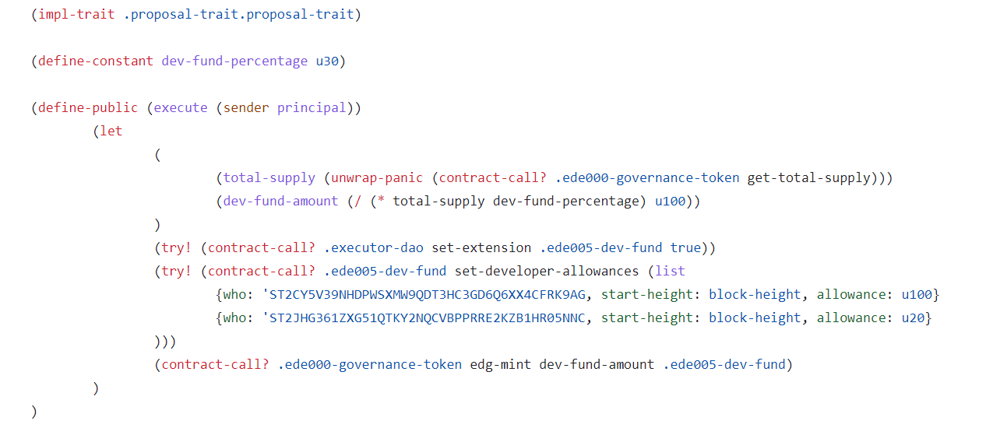
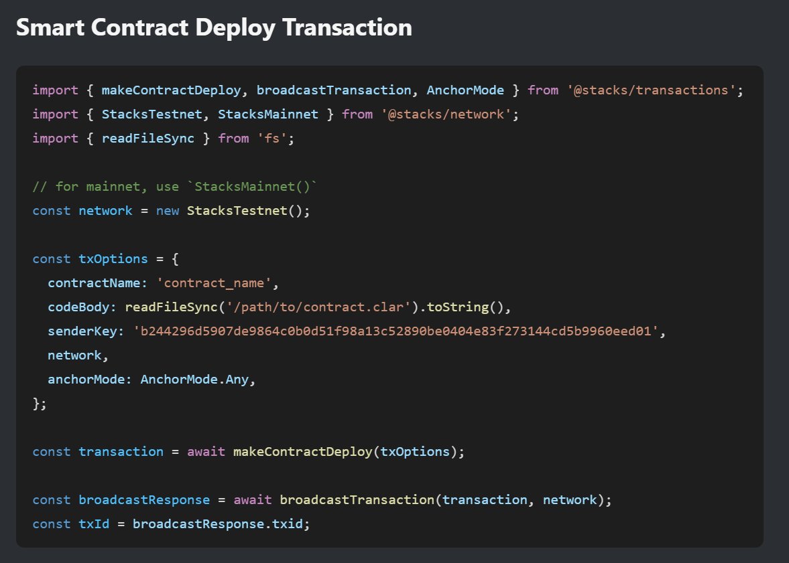

# VibesDAO 
## Flow of Proposal Submission and Voting

1. Deploy the proposal on testnet/mainnet. This will be the first step a user will take and the proposal won’t be live for voting yet.  
   
   The following is a sample proposal contract:  

     
   
   The user won’t be dealing with the technical hassle of deploying the proposal. This will done using the following function:  

     
   https://stacks.js.org/modules/_stacks_transactions

   This will allow the user to simply give the certain variable values (e.g. initial amount, total amount, description etc.) and the user will be able to deploy the proposal using our web app with a simple button click.

2. After the proposal is deployed successfully on chain, it will have a unique identifier. 
(e.g. ST3B5YKP344KCZ5Q8VKA5PNRF3X546PMP80EMWC10.vdp001-kill-emergency-execute) 
This identifier will be stored on HireVibes backend to maintain a record of submitted proposals.  

   Now, user will be able to make the proposal go live on DAO for voting. The user will click a button (e.g. Go Live). This will call the function **“propose”** from [vde002-proposal-submission](https://explorer.hiro.so/txid/0x6019aa15c5de6ebfef935e8cfb726d720206c6641c8af29de14a91b4977d3a4a?chain=testnet) with the identifier as a parameter. 
   
   Once this call is successful, the delay/discussion period will start. Once it finishes, the proposal will eligible to be voted upon. 

3. When the voting period expires, the user will call **“conclude”** from [vde001-proposal-voting](https://explorer.hiro.so/txid/0x560b468aca0afa57a4f3e66e8f79e93bc67dccb32ee8345629692a4e78a0194e?chain=testnet). The proposal will execute if the votes in favour exceeded the votes against, otherwise the proposal will not execute just the voting will be concluded.

## Testnet Links

- Extension Trait:
https://explorer.hiro.so/txid/0x81861e4069eb7aa102eb995609b8cfd4191261aa173e02126d635bd5dbd1b62c?chain=testnet  

- Proposal Trait:
https://explorer.hiro.so/txid/0x8030b1bd0bd4d8e084dfeb0a8ab3939de793a44d79d1365c8ceae1cd67c860f0?chain=testnet  

- VibeDAO:
https://explorer.hiro.so/txid/0xc08847334f924dd26a6bc9c32235cef587ae0a73d0fcab95ac5f53241a566877?chain=testnet

- vde000-treasury:
https://explorer.hiro.so/txid/0x899b6d0348fbd13c52e54dc6d3ee4aabffffa7c9998e2bc1d010c5d3eff0e80c?chain=testnet  

- vde001-proposal-voting:
https://explorer.hiro.so/txid/0x560b468aca0afa57a4f3e66e8f79e93bc67dccb32ee8345629692a4e78a0194e?chain=testnet  

- vde002-proposal-submission:
https://explorer.hiro.so/txid/0x6019aa15c5de6ebfef935e8cfb726d720206c6641c8af29de14a91b4977d3a4a?chain=testnet

- vde003-emergency-proposals:
https://explorer.hiro.so/txid/0x0b66330f723709a6e4a5ab37ea70de4cd6b9fb53f2a84a67f122bfd3b6719fcb?chain=testnet

- vde004-emergency-execute:
https://explorer.hiro.so/txid/0x72e84182ff9ca552787edb78c8755958f9c8308d05139ae0ada16da5011c4167?chain=testnet